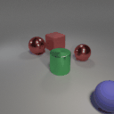
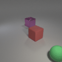
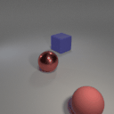
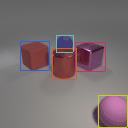
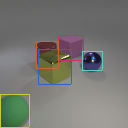
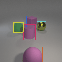

# 3D Interactions Dataset Based on CLEVR

This is an official implementation of 3D interactions dataset generation for the GSWM model presented in the following paper:

> [Improving Generative Imagination in Object-Centric World Models](https://proceedings.icml.cc/static/paper_files/icml/2020/4995-Paper.pdf)  
> *[Zhixuan Lin](www.zhixuanlin.com), [Yi-Fu Wu](www.yifuwu.com), [Skand Peri](pvskand.github.io), Bofeng Fu, [Jindong Jiang](www.jindongjiang.me), [Sungjin Ahn](www.sungjinahn.com)*
> *ICML 2020*  
> [Project page](https://sites.google.com/view/gswm)

## General

Project directories:

- `3d_interactions_generation.py`: source code for dataset generation
- `model`: source materials for 3D-interactions dataset, clone from the [CLEVR dataset](http://cs.stanford.edu/people/jcjohns/clevr/), include:
  - `shapes`: objects’ shapes
  - `materials`: objects’ materials
  - `base_scene.blend`: python code for building base scene in Blender
- `utils`: some useful scripts for generating train/test/val datasets, making gifs, and showing demos

## Dependencies

This project uses Python 3.6 and Blender 2.81a. I recommend using anaconda for dependency management.

```
conda create -n 3d-interaction python=3.6
conda activate 3d-interaction
```

Note that this implementation requires Blender 2.81a, and it is not compatible with previous Blender versions.

## Dataset

We generate the 3D Interactions dataset using Blender [(Community, 2018)](http://www.blender.org.), and Python, with the same base scene and object properties as the CLEVR dataset [(Johnson et al., 2016)](https://openaccess.thecvf.com/content_cvpr_2017/papers/Johnson_CLEVR_A_Diagnostic_CVPR_2017_paper.pdf).

We use three different objects (sphere, cylinder, cube), two different materials (rubber, metal), three different sizes, and five different colors (pink, red, blue, green, yellow) to generate the scenes. All objects move on a smooth surface without friction. 

*Note: the sizes and colors can be reset by yourself, and are not limited to our choice.*

The 3D dataset can be downloaded from this google drive link: [OBJ3D.zip (7G)](https://drive.google.com/file/d/1XSLW3qBtcxxvV-5oiRruVTlDlQ_Yatzm/view?usp=sharing).

The `data` directory should look like this:

```
data
└── OBJ3D
    ├── test
    ├── train
    ├── val
    ├── bboxes.npy
    └── pres.npy
```

In this dataset, we split our dataset into 2920 episodes for training, and 200 episodes for validation and test. Each episode has a length of 100. 

## Images generation

To generate the dataset, we randomly put 3 to 5 objects in the camera scene, and launch a sphere into the scene colliding with other objects. The appearance and incident angle of this initial sphere are also randomly selected. 

### 3D interactions

<div align="center">
  
  
  
</div>

### 3D interactions with bounding box

<div align="center">
  
  
  
</div>

# How to Run?

We render synthetic images using [Blender](https://www.blender.org/). The outputs are rendered images along with bounding boxes information for every image.

Blender has Python inference, thus we can use Python command to execute blender scripts. Before this, you need to add Blender directory to Python `PATH`. You may refer to this [blog](https://osxdaily.com/2014/08/14/add-new-path-to-path-command-line/).

We also use GPU to accelerate rendering. We use NVIDIA GPU with CUDA 9.2 installed. Then, you can render some images like this:

```
cd ./
blender --background --python 3d.py
```

# Misc

## Contact

If you have any questions, please email Bofeng Fu at bofeng_fu@163.com

## Reference

[1] Community, B. O. *Blender -a 3D modelling and rendering package*. Blender Foundation, Stichting Blender Foundation, Amsterdam, 2018. URL: http://www.blender.org. 

[2] Johnson, J. E., Hariharan, B., van der Maaten, L., Fei-Fei, L., Zitnick, C. L., and Girshick, R. B. Clevr: A diagnostic dataset for compositional language and elementary visual reasoning. *2017 IEEE Conference on Computer Vision and Pattern Recognition (CVPR)*, pp. 1988–1997, 2016.